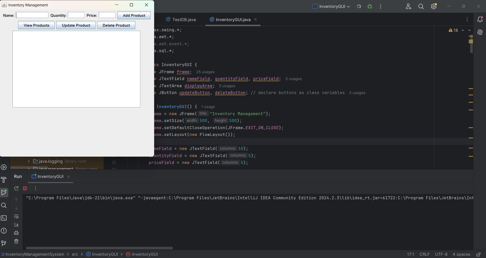
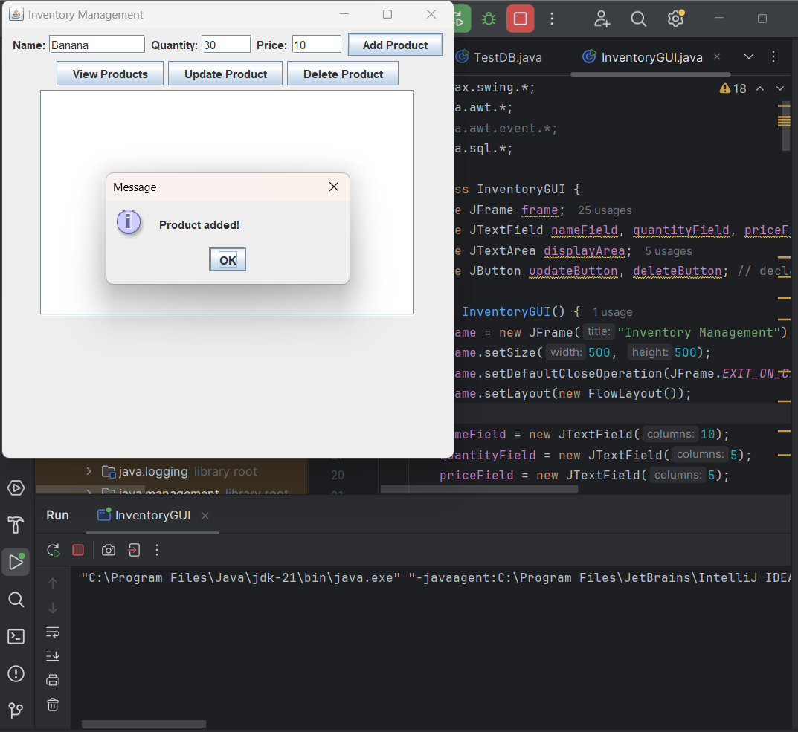
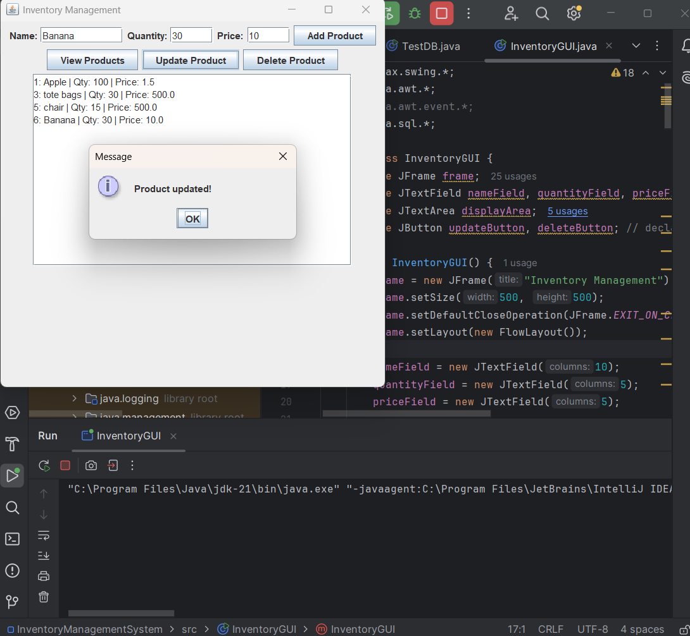
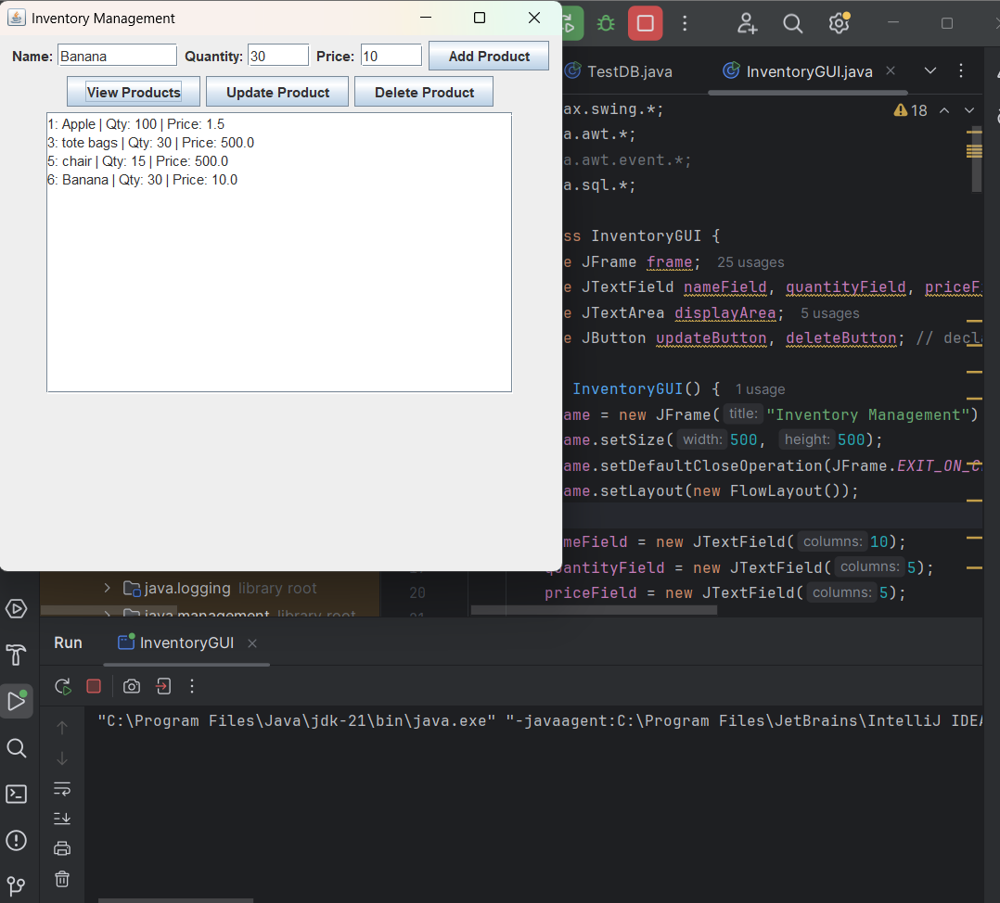
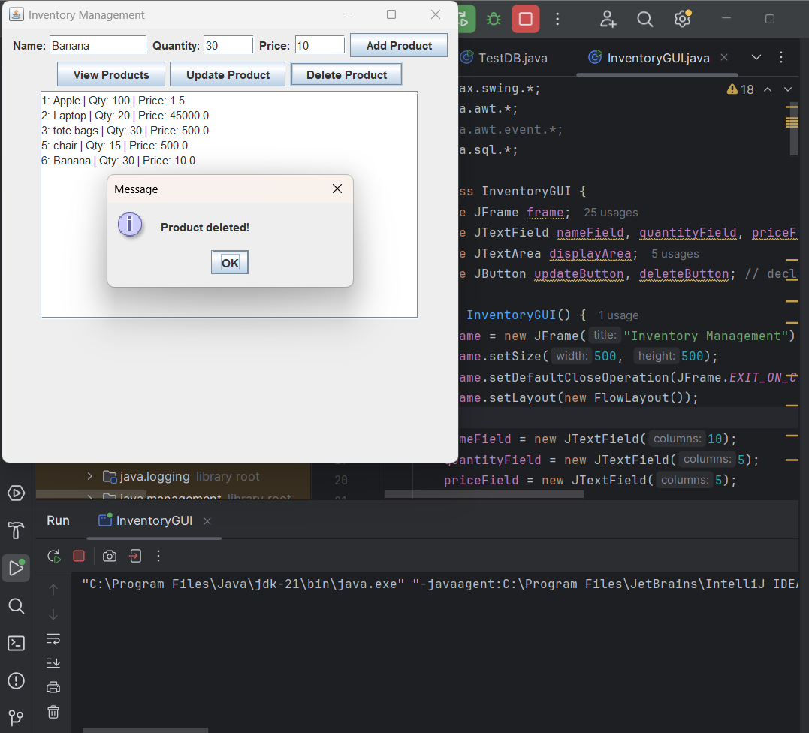

# Java Inventory Management System

A simple inventory management system built using **Java Swing** for the GUI and **MySQL** for the database.  
This project allows businesses to manage their stock, sales, and purchases efficiently.

---

## 🚀 Features
- Add, update, delete, and view products
- User-friendly GUI built with Java Swing
- Database integration using MySQL
- Screenshot previews of application functionality

---

## 📂 Project Structure
- `src/` – Java source files
- `screenshots/` – Screenshots of the application
- `InventoryManagementSystem.iml` – IntelliJ project file
- `.gitignore` – Git ignore rules

---

## 🖼️ Screenshots

### Main GUI


### Add Product


### Update Product


### View Products


### Delete Product


---

## ⚙️ Technologies Used
- **Java** (Swing for GUI)
- **MySQL** (database)
- **JDBC** (database connectivity)

---

## ▶️ How to Run
1. Clone this repository:
   ```bash
   git clone https://github.com/SaiDivyaChukka/Java-Inventory-Management.git
2. Open the project in IntelliJ IDEA (or any IDE that supports Java).

3. Configure your MySQL database connection in DBConnection.java.

4. Run Main.java to start the application.

✨ Future Improvements

Add user authentication

Generate sales reports

Export inventory data to CSV/Excel

## 👩‍💻 Author
**Sai Divya Chukka**

